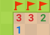
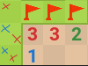
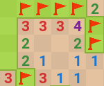
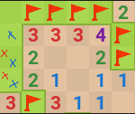

# Challenges

Here I document some of the challenges I faced when making this bot.

## Starting
Having the bot start the game was pretty simple. Using the [webbrowser](https://docs.python.org/3/library/webbrowser.html) module, I'm able to easily open up the page for the game and using [pyautogui](https://pyautogui.readthedocs.io/en/latest/) I'm able to manually move to mouse to positions on the screen in order to start the game.

## Mouse positions
Now having the capability of moving the mouse wherever I want, I need a quick way to get some working dimensions so I know where to direct the mouse. The [coords](https://addons.mozilla.org/en-US/firefox/addon/coords/) extension for Firefox made this a lot simpler.

## Tile recognition
Ok, now we can move the mouse and we know where to move it, what next? Well we need to figure out what to do when a mouse gets to a tile, and the first step is to first figure out what tile the mouse was on. I first tried lining up the mouse on the exact pixel where the color of the number was, using the `pyautogui.screenshot()` function, then analyzing the pixel where my mouse was. This was bad for several reasons.
1. I hadn't realized it at the time but `pyautogui.screenshot()` screenshots the entire screen which I don't need and is probably time consuming
2. I was relying that my tiny mouse pointer would land exactly on the tiny part of the tiny square where there was color
3. The color of the number (or any pixel shape really) fades near the edges so results weren't always accurate

Clearly there's a lot that can be improved upon here, so here are some solutions:
1. Instead of taking a screenshot of the entire screen, I can take a screenshot of just the one square using `pyautogui.screenshot(region=)`. Now we're not grabbing the entire screen
2. Once I have this small screen shot, I can use the `PIL.image.getcolors()` function to obtain an unsorted list of every distinct color in the screenshot along with their pixel frequency (which would be at max 20x20 pixels wide, not very big relatively speaking).
3. Once I get the colors, I can filter out the faded edges of the number by removing the lower pixel frequencies to get the most dominate colors for each tile. This would either be just the background color, just the grass color or a combination of background and number.
4. After that, I wrote a small function to determine the nature of the tile, and now we have tile recognition!

After all this work, I don't forsee any issues that would completely break anything.

## Difficult numbers
I'm lazy and don't want to make a replica of Google minesweeper, but I also need to ensure that the mouse is able to detect every number, even the ones that don't show up very often like 6, 7 and 8. However, it's very hard to test for something that happens very rarely that you also can't control. 

Thankfully, [others](https://www.reddit.com/r/Minesweeper/comments/s10ek7/got_a_7_and_a_6_google_minesweeper/) on the internet have encountered these numbers and have been kind enough to [document them](https://www.reddit.com/r/Minesweeper/comments/oxyatz/my_first_8_tile/). 

Now I can screenshot a game I have in progress and using photo editing software like [Gimp](https://www.gimp.org/) can easily test that these values work and refine my algorithm when they don't.

## Outside the board
Should a tile be uncovered near the edge of the board, there's a chance that at some point the bot will find enough empty tiles and start flagging or uncovering the adjacent tiles. This is great if it's inside the board but this also brings the chance of the bot clicking outside the board

I implemented a small function to check if coordinates to click on are valid.

## Ignoring tiles
The Google minesweeper board on hard difficulty is 24 tiles wide by 20 tiles tall. Doing the math that's 480 total tiles. If I was to check every single tile every time I scanned the board, it would take a while, so I needed to find a way to optimize this. 

I created a list of each tile index to keep track of the tiles I still have to search. Right off the bat, I know that I don't need to search background (dirt) tiles or tiles that have been flagged because I know I'm not going to do anything with them. I'll need to always search grass tiles because they may end up being useful later on, and obviously the uncovered tiles, but only while they have information to give.

Once an uncovered tiles has either flagged all surrounding tiles or clicked all surrounding tiles, there's no need to search it again because it won't offer any new information. All of it's surrounding tiles have been either clicked or flagged so I can ignore them going forward.

Great, now I have a way to speed things up. My initial implementation for this was to use a while loop with a list of coordinates and remove them in transit as tiles became uncovered, but I encountered an unexpected problem. For some reason, tiles that weren't supposed to be removed from this list we're getting removed. 

I had been stuck on this one problem for days. This was a serious issue because if I'm not able to properly ignore tiles, I would essentially need to never ignore any tiles so the game would never lock. This means that I would need to search 480 tiles every time the search looped. Not only this, but as the game progress and more tiles are uncovered, I need to spend more time searching all of those adjacent tiles which slow down the bot even more.

So let's do some debugging. 

Maybe Python doesn't like the way I'm removing indices to search in the while loop. Ok, let's fix that, in stead of removing indices using `list.pop()`, I'll remove things stored in the list using `list.remove()` which removes the first occurence of an element in a list. Since the items in the list are unique, this shouldn't pose an issue. Unfortunately the problem persisted.

Maybe removing things from my list at all won't work. Instead of this, how about I simply store all of the indices I still need to search in a temporary list and then replace the main list as I go. This is actually an improvement since `list.pop()` and `list.remove()` are both O(n) operations whereas adding to a list is *amortized* O(1) (thank you COMP2402). Problem still persists.

Ok this is getting annoying.

At this point I decided to throw in the towel for a bit. I set up a boolean tracker that would reset the search list if no changes had been made. This was *painfully slow* so I decided to take another stab at it.

For once in my life, I actually used a debugger to track the list as the game progressed. But now I wasn't seeing this behavior. Had the bug magically disappeared? No, the debugger would pause everytime a tile needs to have it's adjacent tiles clicked. In other words the bot *slowed down* this gave me an indication that maybe the speed of the bot was the issue.

But obviously this bot needs to be blazing fast (🚀) so I couldn't sacrifice speed. I decided to add some print statements to the main logic where I finally discovered the main cause of the bug. *The tiles that were getting ignored were being misidentified as dirt or flag tiles*

Why were they getting misidentified, why was this only happening in some cases and what does the speed (🚀) of the bot have to do with anything? When you click a tile to remove it in Google minesweeper, a little ~~infuriating~~ animation of the tile flying away plays. As you might've guessed it, as the bot moves from clicking a tile to screenshotting the next one, this animation would still be playing so instead of the screenshot consisting only of a tile, it would consist of a little green square obscuring a tile. This, in turn, would mess up the colors found in that screen shot and because the only known color in the messed up screenshot is dirt, that's all it recoginized, returned and then ignored.

Luckily, after several days of debugging, the fix for this was simple. Since a dirt tile is composed of a single color and each screenshot contains exactly 400 pixels (20 x 20), I could simply check if the color of a tile was a dirt tile *and* that color appeared in 400 pixels. If it didn't well we treat the same way as grass and re-vist it later. Point being, now no tiles are getting ignored prematurely. 

*sigh*

## "Advanced searching"
Forewarning, I'll be using the term "advanced searching" because I can't think of a term to describe it better, but essentially what is meant by this term is an algorithm for playing the game that may not be immediately obvious to those who don't play minesweeper alot. 

So what do I mean by "advanced searching"?

Consider the following scenario

We can see that the 1 in the bottom corner has one mine adjacent to it remaining and the 3 above it also has one mine adjacent to it remaining. Playing as you would normally, it might seem like there are no moves to make here, nothing is outright obvious. However, let's look at this a bit. 

The 1 in the bottom corner has exactly one mine in the two squares next to it. The 3 above it has exactly one mine in the 3 squares next to it

If one mine has to be in the two tiles marked with a blue x and one mine has to be in the three tiles marked with a red x, then it is impossible for the mine to be in the tile in the top corner. Think of it as just being extra, if we can get rid of those extra tiles, we can uncover more information about the board which might in turn, allow us to progress further along the board then we could. 

Advanced searching techniques like this are pretty much necesarry to beat Google minesweeper on hard difficulty. Rarely have I played games where I've never had to use them and won.

These kinds of techniques can also be applied to find mines where it might not be obvious, consider this scenario

The two in the bottom right corner has one adjacent mine remaining in the two tiles next to it. The two above it has two adjacent mines remaining in the three tiles next to it. 

There's definitely a mine somewhere, but it's may not be entirely obvious, again we take a closer look

The two in the bottom left corner must have exactly one mine in the tiles marked with a red x. The two above it must have exactly two mines in the tiles marked with a blue x. Since we know that there is exactly one mine in the two tiles marked with a red x and exactly two mines in the tiles marked with a blue x, then there must be exactly one mine in the tile marked only with a blue x.

With both of these strategies, you can win pretty much any game that doesn't require guessing.